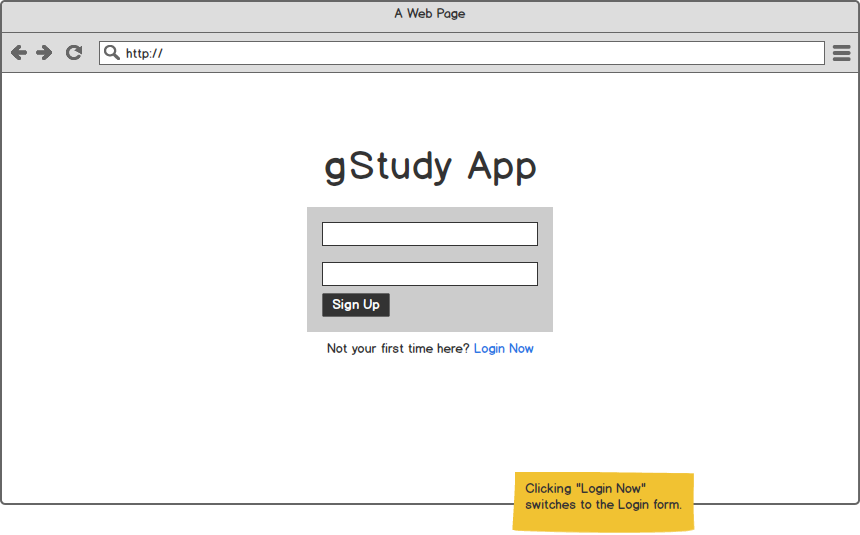
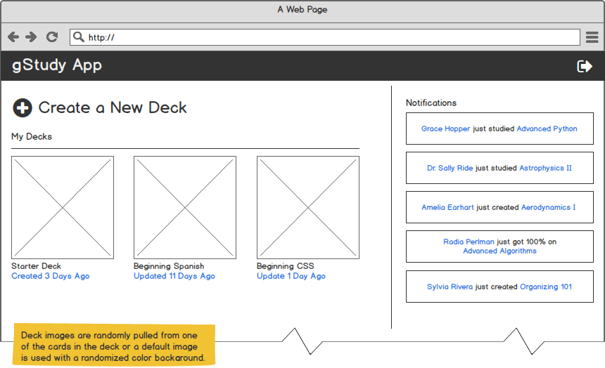
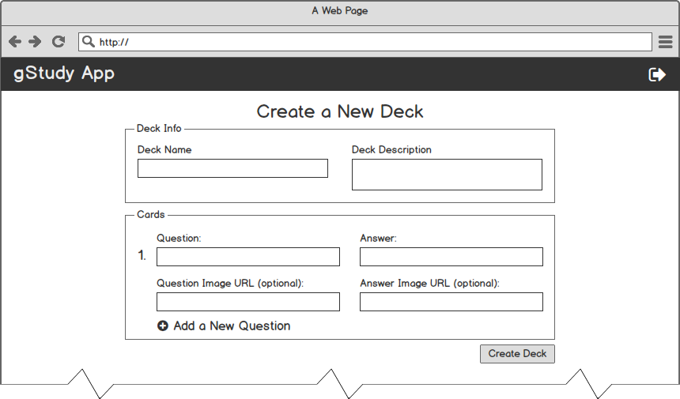
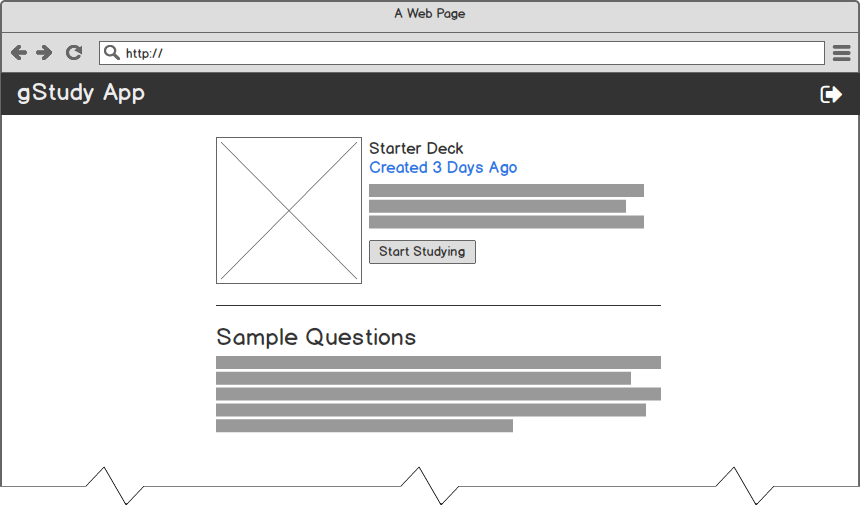
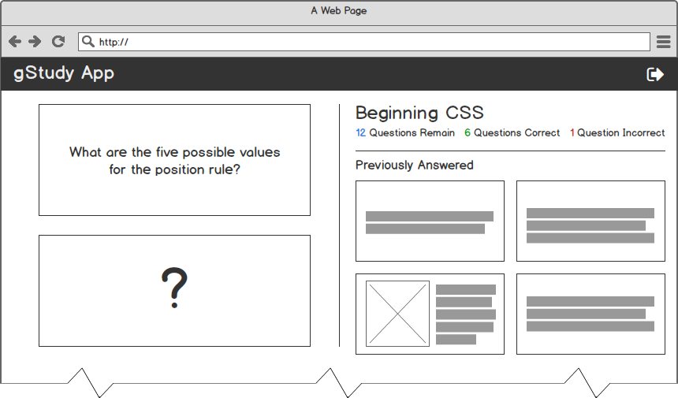
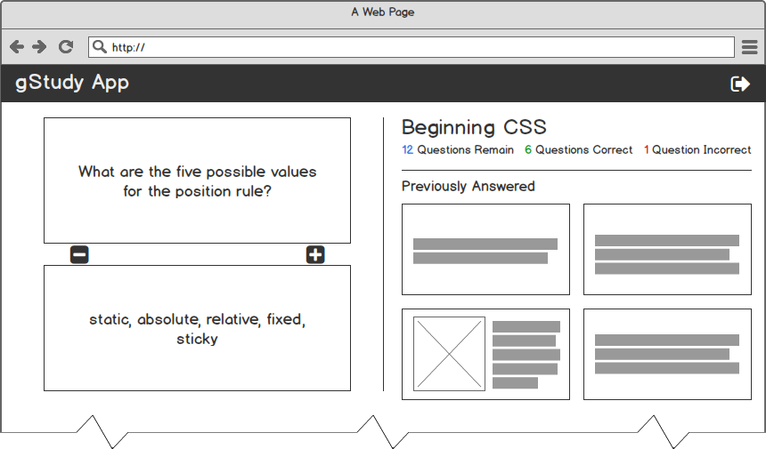

# gStudy Application

You will be building a Flashcard application using the NEAP stack.
The idea of the application is that users can create their own decks
of flashcards which they can review or share with others using the
application.


### Objectives

The goal of this project is to demonstrate your knowledge of the full NEAP stack. We will be looking for:

* A Node/Express application that connects to a PostgreSQL database
* A sensible data model based on the requirements of the application
* An Angular front-end application
* Use of sockets


### Pivotal Stories

```
Id,Title,Labels,Iteration,Iteration Start,Iteration End,Type,Estimate,Current State,Created at,Accepted at,Deadline,Requested By,Description,URL,Owned By
118864247,"As a user, I want to see my saved decks on my main dashboard","",1,"May 2, 2016","May 8, 2016",feature,,unstarted,"May 3, 2016",,,Wes Reid,"The page should include at least the following:

* The user's associated decks should be shown on the page with an image
* The image should either be a random image from one of the cards or a default image/background
* There should be a link to create a new deck",https://www.pivotaltracker.com/story/show/118864247,
118864405,"As a user, I want notifications about what's happening on the site in real-time to show up on my dashboard","",1,"May 2, 2016","May 8, 2016",feature,,unstarted,"May 3, 2016",,,Wes Reid,"As actions happen on the site, the user's notifications panel should begin to fill with who is doing the action and what happened. Examples include:

* [someone] created a new deck
* [someone] finished reviewing [deck name]
* [someone] scored 100% on [deck name]

For live updates, you should use sockets.",https://www.pivotaltracker.com/story/show/118864405,
118864509,"As a user, I want to be able to preview more information about my deck before reviewing it","",1,"May 2, 2016","May 8, 2016",feature,,unstarted,"May 3, 2016",,,Wes Reid,"Create a deck ""show"" page which displays information about the deck the user is about to review. It should include all available information about the deck and some example questions from it.",https://www.pivotaltracker.com/story/show/118864509,
118864617,"As a user, I want to be able to review a full deck","",1,"May 2, 2016","May 8, 2016",feature,,unstarted,"May 3, 2016",,,Wes Reid,"When a user decides to review a deck, they should be shown a view that takes them one-by-one through each card in the deck. They should be shown the question first and then click something (e.g. a button, the ""backside"" of the card) to have the answer revealed.

After it is revealed, the user is presented with two buttons to report whether they got it right or not. Whichever they choose, the question is moved to another side of the page where some status are kept and updated.

This process is repeated until all cards have been scored.",https://www.pivotaltracker.com/story/show/118864617,
118864457,"As a user, I want to be able to create a new deck with a variable number of question/answer pairs","",1,"May 2, 2016","May 8, 2016",feature,,unstarted,"May 3, 2016",,,Wes Reid,"Users should be able to create a new deck with a variable number of questions. The page will start with a deck title, deck description, and a single question/answer. Questions and answers can each have an optional image associated with them.

The user should dynamically be able to add new cards to the page until they have finished. Once their deck is complete, the submit button will create the deck and all associated cards.",https://www.pivotaltracker.com/story/show/118864457,
118864199,"As a user, I want to be able to create a new account for the website","",1,"May 2, 2016","May 8, 2016",feature,,unstarted,"May 3, 2016",,,Wes Reid,"Users need only have a name, email, and password. Make sure you're storing authentication in such a way so that if the user refreshes after logging in, they're still logged in!",https://www.pivotaltracker.com/story/show/118864199,
118864187,"As a user, I want to be able to login to the website","",1,"May 2, 2016","May 8, 2016",feature,,unstarted,"May 3, 2016",,,Wes Reid,"Users need only have a name, email, and password. Make sure you're storing authentication in such a way so that if the user refreshes after logging in, they're still logged in!",https://www.pivotaltracker.com/story/show/118864187,
118865173,"Stretch: As a user, I want to be able to use the site on my phone","",1,"May 2, 2016","May 8, 2016",feature,,unstarted,"May 3, 2016",,,Wes Reid,"Using a responsive grid framework, design the site to be mobile responsive so that you can use the app on your phone. Remember, you can hide parts of the page on different views.",https://www.pivotaltracker.com/story/show/118865173,
118864689,"Stretch: As a user, I want the cards I've previously gotten wrong to be focused on during a subsequent play-through ","",1,"May 2, 2016","May 8, 2016",feature,,unstarted,"May 3, 2016",,,Wes Reid,"Keep track of how a user does on each run-through. The next time they review that deck, show the cards they got wrong more often than the ones they got right.

There are a number of ways to do this; pick a way that you find interesting!",https://www.pivotaltracker.com/story/show/118864689,
118864639,"Stretch: As a user, I want to be able to clone decks from other users","",1,"May 2, 2016","May 8, 2016",feature,,unstarted,"May 3, 2016",,,Wes Reid,"Users should be able to visit someone else's deck and ""clone"" it -- that is, it should show up on their dashboard.

Take into consideration what you will and will not be able to do easily based on how you set this up in your data model.",https://www.pivotaltracker.com/story/show/118864639,

```


### Overall Data Concept

You will decide which tables to create and how you want to create relationships between those tables. However, speaking generally:

* Users have many decks
* Decks have many cards
* Decks can be "cloned"
* Cards have a question and answer
* Cards will have some sort of score


### Mockups

__Home Page defaults to a register page__



__The main dashboard__



__Create a new deck__



__A deck show page__



__The initial view when going through a deck__



__The secondary view when going through a deck__


